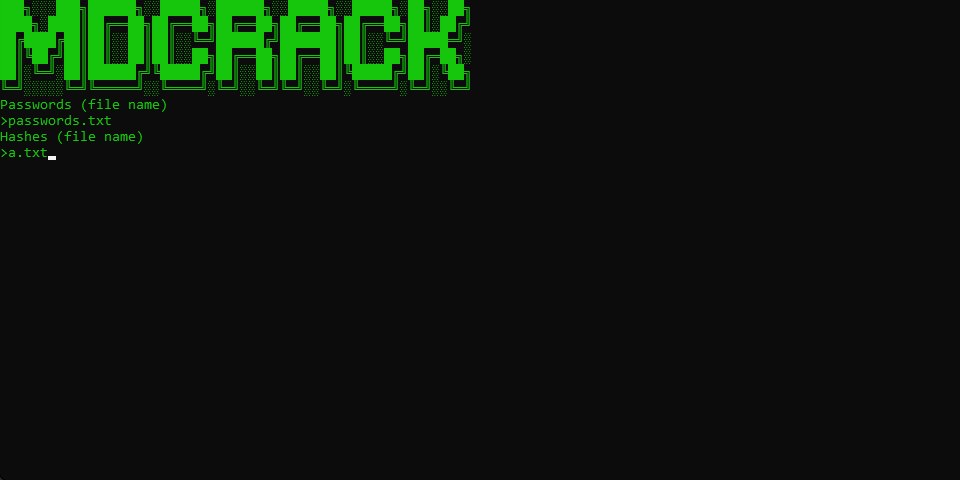

# MDCrack

A tool used for cracking md5 hashes using a passwords list

Supports multithreading and cracking multiple hashes at once

## Setup

First you have to get a passwords list, I suggest getting one from [here](https://github.com/danielmiessler/SecLists)

then you have to put all the hashes into a file and just use it

if you cant figure out how to use it you honestly dont
## ScreenShots

